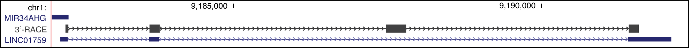

##Introduction
In order to define the 3' transcription stop site for the miR34a asRNA, 3'-RACE was performed.

##Methods
All cell lines were cultured at 5% CO2 and 37° C with U2OS cells grown in McCoy’s 5a (Life Technologies). All growth mediums were supplemented with 10% heat-inactivated FBS and 50 μg/ml of streptomycin and 50 μg/ml of penicillin. U2OS cell RNA was polyA-tailed using yeast polyA polymerase after which cDNA was synthesized using oligo(dT) primers. Nested-PCR was performed first using a forward primer in miR34a asRNA exon 1 (miR-34a asRNA F10 forward primer - ACGCGTCTCTCCAGCCCGGGAT) and a tailed oligo(dT) primer (poly T T7-FAM) followed by a second PCR using an alternate miR34a asRNA exon 1 primer (miR-34a asRNA F1 forward primer - AGCGGCATCTCCTCCACCTGAAA) and a reverse primer binding to the tail of the previously used oligo(dT) primer (FAM primer). PCR products were gel purified and cloned the Strata Clone Kit (Agilent Technologies), and sequenced.

##Results
  

  
3’-RACE sequencing results displayed in the UCSC genome browser together with the annotated miR34a asRNA transcript from GENCODE.

##Conclusions
Sequencing of the resulting cloned cDNA indicated the transcripts 3’ transcription termination site to be 125bp upstream of the RP3-510D11.2 transcript’s annotated termination site 