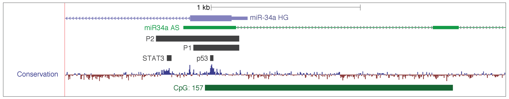
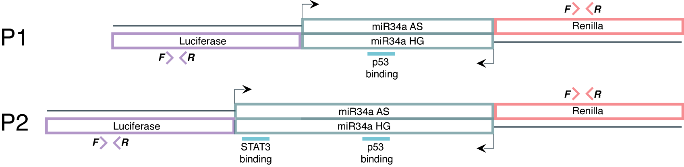

#Introduction
It is likely, due to the head-to head orientation of miR34a HG and asRNA, that transcription initiation may be activated from a single promoter in a bi-directional manner. To investigate whether miR34a HG and asRNA are transcribed from the same promoter as convergent transcripts, we cloned the miR34a HG promoter, including the p53 binding site, into a luciferase/renilla dual reporter vector which we hereafter refer to as p1. The p1 sequence was previously published in Raver-Shapira, N., et al., Transcriptional activation of miR-34a contributes to p53-mediated apoptosis. Mol Cell, 2007. 26(5): p. 731-43. Due to the observance of additional conservation sites downstream of the previously published miR34a HG promoter, we also cloned a longer "promoter region", extending 251 additional base pairs into the miR34a HG into the same bi-directional reporter vector, hereafter refered to as p2.

#Methods
All cell lines were cultured at 5% CO2 and 37° C with HEK293T cells cultured in DMEM high glucose (Hyclone) and HCT116 cells in McCoy’s 5a (Life Technologies). All growth mediums were supplemented with 10% heat-inactivated FBS and 50 μg/ml of streptomycin and 50 μg/ml of penicillin. Cells were plated at 10,000 cells per well in a 96-well plate with a white bottom and cultured overnight. The following day cells were co-transfected with 10ng of empty, p1, or p2 plasmid and GFP using the standard lipofektamine 2000 (Life Technologies) protocol. The expression of GFP and luminescence was measured 24 h post transfection by using the Dual-Glo Luciferase Assay System (Promega) and detected by the GloMax-Multi+ Detection System (Promega). The expression of luminescence was normalized to GFP.

##Constructs
```{r}
library(printr)
ps <- data.frame(
    name=c("p1", "p2"),
    sequence=c("GCG CCC TGC CTG GCC CCC ACC TGG TCC TCT TTC CTT TTC AGG TGG AGG AGA TGC CGC TGT
              CCC GTC GGT CTG GGG ACA GCC CAG CTC CCC GGA TCC CGG GCT GGA GAG ACG CGT CGC GGC   
              CCC GGG GCC TGG TGG CAC GAG CAG GAA GGA GGA CCC GGC GGC GGG CTC TGC CTG GGC TTG 
              CCT GGG CTT GTT CCG AGC CGG GCT GCT TCT CGG TGA CCA CGC AGA TCG GGG GCA TTT GGA
              GAT TTT GCG GGA GTC CTG CAG CCA AGC TCC GGG GCA GGA GAG GCC TGG AAG CCT GCA CTA
              CCT GCT C",
              "GCG CCC TGC CTG GCC CCC ACC TGG TCC TCT TTC CTT TTC AGG TGG AGG AGA TGC CGC TGT 
              CCC GTC GGT CTG GGG ACA GCC CAG CTC CCC GGA TCC CGG GCT GGA GAG ACG CGT CGC GGC
              CCC GGG GCC TGG TGG CAC GAG CAG GAA GGA GGA CCC GGC GGC GGG CTC TGC CTG GGC TTG 
              CCT GGG CTT GTT CCG AGC CGG GCT GCT TCT CGG TGA CCA CGC AGA TCG GGG GCA TTT GGA 
              GAT TTT GCG GGA GTC CTG CAG CCA AGC TCC GGG GCA GGA GAG GCC TGG AAG CCT GCA CTA 
              CCT GCT CGC CCC GTC CCA GCA TGC ACC CAG GTA AAC GCT TGT GTT TCT CAG TCC GTG CGA 
              AAG TTT GCA AAG AAG GAG GCG GGA ACT AGA CCA ACA ACT TTA ATA ATC ATA GTC ATA ATA 
              ATG AAA ACC CTG TTC AAT TGT GTA GCC TCC GTA AGG GGA AGA ATT TCC AAG AAG CAA CAA
              AAT GTT CTT TGA TTT CAT AAT CTC TGG GGA GAA AGG ATT CCT TTT TTG GGG TTT TGC TCG
              GCT AGT TCT TTC TTC CCT")
)
ps
```

##Primers
```{r}
primers <- data.frame(
    name=c(
        "Luc_set_II_F",
        "Luc_set_II_R",
        "Renilla_pBiDir_F1",
        "Renilla_pBiDir_R1",
        "B-actin_F",
        "B-actin_R"
    ),
    sequence=c(
        "AAG ATT CAA AGT GCG CTG CTG",
        "TTG CCT GAT ACC TGG CAG ATG",
        "TAA CGC GGC CTC TTC TTA TTT",
        "GAT TTG CCT GAT TTG CCC ATA",
        "AGG TCA TCA CCA TTG GCA ATG AG",
        "CTT TGC GGA TGT CCA CGT CA"
    )
)
primers
```

#Results

<center></center>
<br></br><br></br>
<center></center>
<br></br><br></br><br></br>

```{r}
library(reshape2)
library(ggplot2)
library(ggthemes)
library(plyr)
data <- read.table('~/GitHub/miR34aFigures/inst/P1-HCTandHEK/luminesenseData.txt', header=TRUE, sep="\t")

summary <- ddply(
    data, 
    c("cellLine", "gene", "construct"),
    summarize,
    mean = mean(value),
    pValue = t.test(value, data[data$cellLine == cellLine & data$gene == gene & data$construct == "empty", "value"])$p.value,
    CI95l = t.test(value)$conf.int[1],
    CI95h = t.test(value)$conf.int[2]
)

data <- merge(data, summary, by=c("cellLine", "gene", "construct"))

data$pValue <- ifelse(data$pValue == 1, NA, data$pValue)

data$pStars <- ifelse(
    data$pValue < 0.05 & data$pValue > 0.0049, 
    "\u2605", 
    ifelse(
        data$pValue < 0.005 & data$pValue > 0.00049, 
        "\u2605\u2605",
        ifelse(
            data$pValue < 0.0005, 
            "\u2605\u2605\u2605",
            ""
        )
    )
)

#prepare for plotting
data$gene <- ifelse(data$gene == "renilla", "Renilla", "Luciferase")
data$construct <-gsub("empty", "Empty", data$construct)
```

```{r, fig.align='center', fig.height=8, fig.width=12, eval=TRUE, message=FALSE, warning=FALSE}
#plot for Rmarkdown
ggplot(data, aes(x=construct, y=value))+
    geom_violin(
        aes(fill=gene),
        trim=TRUE,
        alpha=0.3,
        color=NA,
        scale="width",
        show.legend = FALSE
    )+
    geom_point( 
        aes(colour=gene),
        size=4,
        position=position_dodge(width=0.9),
        stroke=0
    )+
    geom_linerange(
        aes(ymin=CI95l, ymax=CI95h, group=gene),
        colour="black",
        position=position_dodge(width=0.9),
        show.legend = FALSE
    )+
    geom_point(
        aes(y=mean, group=gene),
        colour="black",
        position=position_dodge(width=0.9),
        show.legend = FALSE
    )+
    facet_grid(.~cellLine)+
    geom_label(
        aes(y=CI95h+0.15, label=pStars, group=gene),
        label.size=0,
        label.padding=unit(0.01, "lines"),
        show.legend = FALSE,
        fill="white",
        size=5,
        family="Arial Unicode MS",
        position=position_dodge(width=0.9)
    )+
    labs(
        x="Construct",
        y="Activity (a.u.)",
        title="miR34a asRNA regulation by miR34a promoter",
        caption=
            "miR34a asRNA and miR34a HG levels in HCT116 and HEK293t cells after transfection with P1 and P2 constructs.\nLuciferase represents miR34a HG and renilla represents miR34a asRNA.\nError bars (black vertical) indicate 95% CI and means are represented \nby black dots. \u2605 = p < 0.05; \u2605\u2605 = p < 0.005, \u2605\u2605\u2605 = p < 0.0005."
    )+
    theme_few()+
    scale_fill_ptol()+
    scale_colour_ptol()+
    #values=c("#014d64", "#6794a7")
    theme(
        plot.title = element_text(
            hjust = 0.5,
            face="bold",
            size=20
        ),
        plot.caption = element_text(
            hjust=0, 
            margin=margin(t=15),
            family="Arial Unicode MS"
        ),
        legend.position="top",
        legend.title=element_text(size=17),
        legend.text=element_text(size=15),
        axis.title=element_text(size=17),
        axis.title.x=element_text(margin=margin(t=10)),
        axis.text=element_text(size=15),
        strip.text.x=element_text(size=17)
    )+
    guides(color = guide_legend(title = "Gene", override.aes = list(size=3)))

#plot for pdf
p <- ggplot(data, aes(x=construct, y=value))+
    geom_violin(
        aes(fill=gene),
        trim=TRUE,
        alpha=0.3,
        color=NA,
        scale="width",
        lwd=0.1
    )+
    #geom_point( 
    #    aes(colour=gene),
    #    size=0.6,
    #    position=position_dodge(width=0.9)
    #)+
    geom_linerange(
        aes(ymin=CI95l, ymax=CI95h, group=gene),
        colour="black",
        position=position_dodge(width=0.9),
        show.legend = FALSE,
        lwd=0.15
    )+
    geom_point(
        aes(y=mean, group=gene),
        colour="black",
        position=position_dodge(width=0.9),
        show.legend = FALSE,
        size=0.5
    )+
    facet_grid(.~cellLine)+
    geom_label(
        aes(y=CI95h+1200, label=pStars, group=gene),
        label.size=0,
        label.padding=unit(0.01, "lines"),
        show.legend = FALSE,
        fill="white",
        size=1,
        family="Arial Unicode MS",
        position=position_dodge(width=0.9)
    )+
    labs(
        x="Construct",
        y="Activity (a.u.)",
        title="miR34a asRNA promoter region"
    )+
    theme_few()+
    scale_fill_ptol()+
    scale_colour_ptol()+
    #values=c("#014d64", "#6794a7")
    theme(
        plot.title = element_text(
            hjust = 0.5,
            face="bold",
            size=10,
            margin=margin(b=2, unit="mm")
        ),
        plot.margin = unit(c(0.1,0.1,0.1,0.1), "lines"),
        legend.position="top",
        legend.margin=unit(1,"mm"),
        legend.key.size = unit(1/5, "cm"),
        legend.title=element_text(size=9),
        legend.text=element_text(size=8),
        axis.title=element_text(size=9),
        axis.title.x=element_text(margin=margin(t=5)),
        axis.text.y=element_text(size=8),
        axis.text.x=element_text(size=7),
        strip.text.x=element_text(size=9, margin = margin(0.01, 0, 0.1, 0, "cm")),
        panel.border = element_rect(fill=NA, size=0.25),
        axis.ticks = element_line(size=0.25),
        axis.ticks.length = unit(1/15, "cm")
    )+
    guides(fill = guide_legend(title = "Gene", override.aes = list(size=2)))

ggsave(plot=p, filename="~/GitHub/miR34aFigures/inst/P1-HCTandHEK/P1-HCTandHEK_P1andP2.pdf", device=cairo_pdf, height=60, width=83, units="mm")

#only P1
data <- subset(data, construct %in% c("Empty", "p1"))
p1 <- ggplot(data, aes(x=construct, y=value))+
    geom_violin(
        aes(fill=gene),
        trim=TRUE,
        alpha=0.3,
        color=NA,
        scale="width",
        lwd=0.1
    )+
    #geom_point( 
    #    aes(colour=gene),
    #    size=0.6,
    #    position=position_dodge(width=0.9)
    #)+
    geom_linerange(
        aes(ymin=CI95l, ymax=CI95h, group=gene),
        colour="black",
        position=position_dodge(width=0.9),
        show.legend = FALSE,
        lwd=0.15
    )+
    geom_point(
        aes(y=mean, group=gene),
        colour="black",
        position=position_dodge(width=0.9),
        show.legend = FALSE,
        size=0.5,
    )+
    facet_grid(.~cellLine)+
    geom_label(
        aes(y=CI95h+1200, label=pStars, group=gene),
        label.size=0,
        label.padding=unit(0.01, "lines"),
        show.legend = FALSE,
        fill="white",
        size=1,
        family="Arial Unicode MS",
        position=position_dodge(width=0.9)
    )+
    labs(
        x="Construct",
        y="Activity (a.u.)"
        #title="miR34a asRNA promoter region"
    )+
    theme_few()+
    scale_fill_ptol()+
    scale_colour_ptol()+
    #values=c("#014d64", "#6794a7")
    theme(
        plot.title = element_text(
            hjust = 0.5,
            face="bold",
            size=10,
            margin=margin(b=2, unit="mm")
        ),
        plot.margin = unit(c(0.1,0.1,0.1,0.1), "lines"),
        legend.position="top",
        legend.margin=unit(1,"mm"),
        legend.key.size = unit(1/5, "cm"),
        legend.title=element_text(size=9),
        legend.text=element_text(size=8),
        axis.title=element_text(size=9),
        axis.title.x=element_text(margin=margin(t=5)),
        axis.text.y=element_text(size=8),
        axis.text.x=element_text(size=7),
        strip.text.x=element_text(size=9, margin = margin(0.01, 0, 0.1, 0, "cm")),
        panel.border = element_rect(fill=NA, size=0.25),
        axis.ticks = element_line(size=0.25),
        axis.ticks.length = unit(1/15, "cm")
    )+
    guides(fill = guide_legend(title = "Gene", override.aes = list(size=2)))

ggsave(plot=p1, filename="~/GitHub/miR34aFigures/inst/P1-HCTandHEK/P1-HCTandHEK_P1.pdf", device=cairo_pdf, height=60, width=83, units="mm")

```

#Conclusion
Upon transfection of this construct in two separate cell lines we observed increases in both luciferase and renilla indicating that miR34a HG and asRNA expression is regulated by a single promoter contained within the p1 construct. Transfection of the P2 construct showed to cause a reduction in luciferase (miR34a HG) levels but not renilla (miR34a AS) levels. This could be due to the presence of a STAT3 binding site in p2 which has been previously reported to negativley regulate miR34a HG.