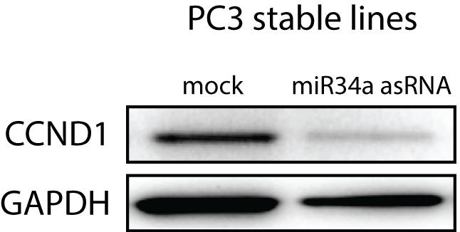

##Introduction

After observing decreased mRNA levels for the miR34a target CCND1, we were interested whether this has also consequences for its protein levels. 

##Methods
All cell lines were cultured at 5% CO2 and 37° C with PC3 cells in RPMI (Hyclone) and 2 mM L-glutamine. All growth mediums were supplemented with 10% heat-inactivated FBS and 50 μg/ml of streptomycin and 50 μg/ml of penicillin. We seeded three independent experiments of 150,000 cells/well in a six well plate (PC3 mock vs. PC3 miR34a AS F4) and grew them for 24 hours. Before harvesting cells were controlled for their confluency. Cells with a confluence of 60-75%, were harvested using trypsin. Cell pellets were frozen down at -80°C before lysed for Western Blot analysis. Western Blot analysis was performed following Lottes’ protocol. Cells were lysed in RIPA Buffer and run on a 4-12% Bis-Tris-SDS Gel using MOPS running buffer. Proteins were transferred onto a nitrocellulose membrane using iBlot Turbo Blotting Device. Proteins were transferred for 7 minutes. Membranes were blocked for 1 hour at room temperature in 5% milk. Membranes were incubated with a cyclin D1 antibody (92G2 Rabbit mAb, Cell Signalling) overnight at 4°C. The membrane was incubated using a goat anti-rabbit antibody conjugated to HRP for 1 hour at room temperature. Membranes were washed 3-times for 5min each in TBS-T. Membranes were developed using chemiluminescence. After the picture was taken, the membrane was stripped using 0.4M NaOH solution for 20min. Blocking step was repeated and primary antibody against GAPDH was incubated for overnight at 4°C. Consequently, the membrane was incubated using a goat anti-rabbit antibody conjugated to HRP for 1 hour at room temperature. Membranes were washed 3-times for 5min in TBS-T. Membranes were developed using chemiluminescence.

##Results

###Representative experiment
<center></center>
<br></br><br></br><br></br>

###Quantification
```{r, warning=FALSE}
library(reshape2)
library(ggplot2)
library(ggthemes)
library(plyr)
data <- read.table('~/GitHub/miR34aFigures/inst/StableLineCCND1prot/WBdata.txt', header=TRUE, sep="\t")
data$value <- (data$Intensity - data$background) * data$pixel

#normalize to GAPDH
ccnd1 <- subset(data, protein == "CCND1")
ccnd1$normValue <- ccnd1$value / data[data$protein == "GAPDH", "value"]

#normalize to control
#ccnd1$percentOfMock <- ccnd1$normValue / ccnd1[ccnd1$condition == "mock" , "normValue"]
toCtrl <- ddply(
    ccnd1,
    c("condition", "experiment"),
    summarize,
    percentOfMock = normValue / ccnd1[ccnd1$condition == "mock" & ccnd1$experiment == 1, "normValue"]
)
ccnd1 <- merge(ccnd1, toCtrl, by=c("condition", "experiment"), all.x=TRUE)

#move data to normal distribution
ccnd1$log2percentOfMock <- log2(ccnd1$percentOfMock)

#calculate statistics
stats <- ddply(
    ccnd1,
    "condition",
    summarize, 
    mean=mean(log2percentOfMock),
    pValue=t.test(log2percentOfMock, ccnd1[ccnd1$condition == "mock", "log2percentOfMock"])$p.value,
    CI95l=t.test(log2percentOfMock)$conf.int[1],
    CI95h=t.test(log2percentOfMock)$conf.int[2]
)

stats$pStars <- ifelse(
    stats$pValue < 0.05 & stats$pValue > 0.0049, 
    "\u2605", 
    ifelse(
        stats$pValue < 0.005 & stats$pValue > 0.00049, 
        "\u2605\u2605",
        ifelse(
            stats$pValue < 0.0005, 
            "\u2605\u2605\u2605",
            ""
        )
    )
)

ccnd1 <- merge(ccnd1, stats, by=c("condition"))

#prepare for plotting
ccnd1$condition <- ifelse(ccnd1$condition == "mock", "mock", "miR34a\nasRNA")
ccnd1$condition <- factor(ccnd1$condition, levels=c("mock", "miR34a\nasRNA"))

```

```{r, fig.align='center', fig.height=8, fig.width=12, eval=TRUE, message=FALSE, warning=FALSE}
#plot for Rmarkdown
ggplot(ccnd1, aes(x=condition, y=log2percentOfMock))+
    geom_violin(
        aes(fill=condition),
        trim=TRUE,
        alpha=0.3,
        color=NA,
        scale="width"
    )+
    geom_point( 
        aes(colour=condition),
        size=4
    )+
    geom_linerange(
        aes(ymin=CI95l, ymax=CI95h),
        colour="black"
    )+
    geom_point(
        aes(x=condition, y=mean),
        colour="black"
    )+
    geom_segment(
        aes(x=1, y=0.5, xend=2, yend=0.5),
        colour="grey43"
    )+
    geom_label(
        aes(x=1.5, y=0.6, label=pStars),
        label.size=0,
        label.padding=unit(0.01, "lines"),
        show.legend = FALSE,
        fill="white",
        size=5,
        family="Arial Unicode MS"
    )+
    scale_y_continuous(
        "log2(Fold)", 
        sec.axis = sec_axis(
            ~2^., 
            name = "Fold", 
            breaks=c(0.1,0.25,0.5,1,1.25,1.5)
        )
    )+
    labs(
      x="Cell line",
      title="CCND1 protein",
      caption=
            "Western blot showing cyclin D1 protein levels in PC3 miR34a asRNA over-expressing stable lines.\nFold = Fraction mock std. to GAPDH. Error bars (black vertical) indicate 95% CI and means are represented by black dots.\n\u2605 = p < 0.05; \u2605\u2605 = p < 0.005, \u2605\u2605\u2605 = p < 0.0005."
    )+
    theme_few()+
    scale_fill_ptol()+
    scale_colour_ptol()+
    #values=c("#014d64", "#6794a7")
    theme(
        plot.title = element_text(
            hjust = 0.5,
            face="bold",
            size=20
        ),
        plot.caption = element_text(
            hjust=0, 
            margin=margin(t=15),
            family="Arial Unicode MS"
        ),
        legend.position="none",
        axis.title=element_text(size=17),
        axis.title.x=element_text(margin=margin(t=10)),
        axis.text=element_text(size=15)
    )

#plot for pdf
p <- ggplot(ccnd1, aes(x=condition, y=log2percentOfMock))+
    geom_violin(
        aes(fill=condition),
        trim=TRUE,
        alpha=0.3,
        color=NA,
        scale="width",
        lwd=0.1
    )+
    #geom_point( 
    #    aes(colour=condition),
    #    size=0.6
    #)+
    geom_linerange(
        aes(ymin=CI95l, ymax=CI95h),
        colour="black",
        lwd=0.15
    )+
    geom_point(
        aes(x=condition, y=mean),
        colour="black",
        size=0.5
    )+
    geom_segment(
        aes(x=1, y=0.5, xend=2, yend=0.5),
        colour="grey43",
        lwd=0.15
    )+
    geom_label(
        aes(x=1.5, y=0.6, label=pStars),
        label.size=0,
        label.padding=unit(0.01, "lines"),
        show.legend = FALSE,
        fill="white",
        size=1,
        family="Arial Unicode MS"
    )+
    scale_y_continuous(
        "log2(Fold)"
        #sec.axis = sec_axis(
        #    ~2^., 
        #    name = "Fold", 
        #    breaks=c(0.1,0.25,0.5,1,1.25,1.5)
        #)
    )+
    labs(
      x="Cell line",
      title="CCND1 protein"
    )+
    theme_few()+
    scale_fill_ptol()+
    scale_colour_ptol()+
    theme(
        plot.title = element_text(
            hjust = 0.5,
            face="bold",
            size=10
        ),
        plot.margin = unit(rep(0.1,4), "lines"),
        legend.position="none",
        axis.title=element_text(size=9),
        axis.title.x=element_text(margin=margin(t=5)),
        axis.text=element_text(size=8),
        axis.line=element_line(size=0.25),
        panel.border = element_rect(fill=NA, size=0.25),
        axis.ticks = element_line(size=0.25),
        axis.ticks.length = unit(1/15, "cm")
    )

#deafult width and height = 7
ggsave(plot=p, filename="~/GitHub/miR34aFigures/inst/StableLineCCND1prot/stableLineCCND1prot.pdf", device=cairo_pdf, height=60, width=42, units="mm")

```

##Conclusions
Cyclin D1 protein levels are significantly reduced in PC3 cells overexpressing miR34a asRNA, consistent with increased miR34a expression levels and the reduced G1 cell cycle phase observed in PC3 cells.