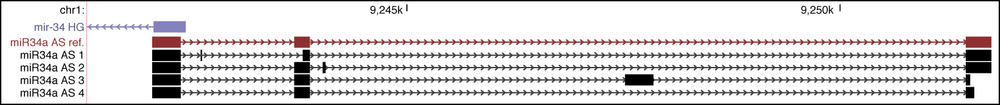

```{r}
library(printr)
```

#miR34a asRNA characterization
###miR34a locus
<br></br>
<center></center>
<br></br>
A schematic picture of the miR34a locus from UCSC genome browser including miR34a HG and mature miR34a (purple) as well as bioinformatic evidence for antisense transcription from 
GENCODE v19 (green) and the spliced human EST track (black). H3K4me3 ChIP-seq data from ENCODE indicating the promoter region and conservation over the locus is also shown.

##miR34a asRNA tissue expression
<br></br>
<center></center>
<br></br>
<center></center>
<br></br>

Semi-quantitative PCR data from the screening of a panel of cell lines. 
* Indicates that, although the cell line is p53wt, other mechanisms are present which inhibit p53 function. 

##Coding Potential
###Coding Potential Assesment Tool
```{r}
cpat <- read.table('../codingPotential/CodingPotentialAssessmentTool/results.txt', header=TRUE, sep="\t")
cpat
```

Coding potential analysis results from the Coding-potential Assessment Tool including miR34a asRNA and 
2 characterized non-coding transcripts (HOTAIR and XIST) and 3 known coding transcripts (β-actin, tubulin, and MYC). 

###Coding Potential Calculator
```{r}
cpc <- read.table('../codingPotential/CodingPotentialCalculator/results.txt', header=TRUE, sep="\t")
colnames(cpc) <- gsub("\\.", " ", colnames(cpc))
cpc
```

Coding potential analysis results using the Coding-potential calculator for miR34a asRNA, HOTAIR, and β-actin.

##3-prime RACE
<br></br>
<center></center>
<br></br>

3’-RACE sequencing results displayed in the UCSC genome browser together with the annotated miR34a asRNA transcript from GENCODE.

##Primer walk assay
<br></br>
<center></center>
<br></br>
<center></center>
<br></br>
A schematic picture of the miR34a asRNA locus including the location of the primers used in the primer walk assay and 
the semi-quantitative PCR results from the primer walk assay performed using HEK293T cells. 

##Stability
<br></br>
<center></center>
<br></br>
Q-PCR showing miR34a asRNA and miR34a HG levels in U2OS cells after treatment with 10nM actinomycin D. Error bars (black vertical) indicate standard deviation and means are represented by black dots.

##Cellular localization
<br></br>
<center></center>
<br></br>
 Q-PCR results from fractionated HEK293T cells investigating the cellular localization of the miR34a asRNA transcript.
 
##miR34a asRNA isoforms
<br></br>
<center></center>
<br></br>
Cloned isoforms of the miR34a asRNA gene.

##Polyadenylation
<br></br>
<center></center>
<br></br>
Polyadenylation status of the spliced and unspliced variants of miR34a asRNA in HEK293t cells. 

#Regulation of miR34a asRNA
<br></br>
<center></center>
<br></br>
Monitoring the effects of 24 hours doxorubicin treatment on miR34a asRNA and HG in p53+/+ and p53-/- HCT116 cells. 

<br></br>
<center></center>
<br></br>
Q-PCR showing miR34a asRNA and miR34a HG levels in HCT116 and HEK293t cells after treatment with 200 ng/ml doxorubicin for 24hrs. Error bars (black vertical) indicate 95% CI and means are represented by black dots. &#9733; = p < 0.05; &#9733;&#9733; = p < 0.005, &#9733;&#9733;&#9733; = p < 0.0005.

##miR34a asRNA promoter
<br></br>
<center></center>
<br></br>
A UCSC genome browser illustration indicating the location of the promoter region cloned into the p1 construct including the conserved p53-binding site.
<br></br>
<center></center>
<br></br>
A representative picture of the p1 construct including forward (F) and reverse (R) primer locations.
<br></br><br></br>
<center></center>
<br></br>
miR34a asRNA and miR34a HG levels in HCT116 and HEK293t cells after transfection with P1 and P2 constructs. Luciferase represents miR34a HG and renilla represents miR34a asRNA. Error bars (black vertical) indicate 95% CI and means are represented by black dots. &#9733; = p < 0.05; &#9733;&#9733; = p < 0.005, &#9733;&#9733;&#9733; = p < 0.0005.

##miR34a asRNA and HG correlation in primary cancer cells
<br></br>
<center></center>
<br></br>
TCGA RNA sequencing data illustrating the correlation between miR34a HG and miR34a asRNA in p53 wt and mutated primary cancer cells.
<br></br>
<center></center>
<br></br>
A table showing R-squared and p-values for each illustrated correlation.
<br></br><br></br>

#Function of miR34a asRNA
<br></br>
<center></center>
<br></br>
miR34a (luficerase) and miR34a asRNA (renilla) in HCT116 cells which were co-transfected with the P1 construct and the specified shRNA after which they were treated with the indicated dose of doxorubicin. Error bars (black vertical) indicate 95% CI and black points represent the mean. &#9733; = p < 0.05; &#9733;&#9733; = p < 0.005, &#9733;&#9733;&#9733; = p < 0.0005.

<br></br>
<center></center>
<br></br>
miR34a asRNA and miR34a levels in PC3, Skov3, and Saos2 cell lines stably over-expressing miR34a asRNA compared to mock over-expressing control. &#916;&#916;ct = House keeping gene - Target gene - mock control. Error bars indicate 95% CI and black points represent the mean. &#9733; = p < 0.05; &#9733;&#9733; = p < 0.005, &#9733;&#9733;&#9733; = p < 0.0005.

<br></br>
<center></center>
<br></br>
miR34a asRNA over-expression levels in PC3, Skov3, and Saos2 stable cell lines compared to HEK293t cells. &#916;&#916;ct = target gene - House keeping gene - HEK293t. Error bars indicate 95% CI and black points represent the mean.

<br></br>
<center></center>
<br></br>
Cell cycle analysis in miR34a asRNA over-expressing PC3, Skov3, and Saos2 stable cell lines compared to their respective mock control. Error bars (black vertical) indicate 95% CI and horizontal lines (black) represent the mean. &#9733; = p < 0.05; &#9733;&#9733; = p < 0.005, &#9733;&#9733;&#9733; = p < 0.0005.

<br></br>
<center></center>
<br></br>
Phosphorylated Poll II ChIP in miR34a asRNA over-expressing PC3 stable cell lines compared to their respective mock control. Error bars (black vertical) indicate 95% CI and black points represent the mean. &#9733; = p < 0.05; &#9733;&#9733; = p < 0.005, &#9733;&#9733;&#9733; = p < 0.0005.

<br></br>
<center></center>
<br></br>
Q-PCR showing cyclin D1 levels in PC3 miR34a asRNA over-expressing stable lines. Error bars (black vertical) indicate 95% CI and means are represented by black dots. &#9733; = p < 0.05; &#9733;&#9733; = p < 0.005, &#9733;&#9733;&#9733; = p < 0.0005.

<br></br>
<center></center>
<br></br>
A representative experiment.
<br></br>
<center></center>
<br></br>
Western blot showing cyclin D1 protein levels in PC3 miR34a asRNA over-expressing stable lines. Fold = Fraction mock std. to GAPDH. Error bars (black vertical) indicate 95% CI and means are represented by black dots. &#9733; = p < 0.05; &#9733;&#9733; = p < 0.005, &#9733;&#9733;&#9733; = p < 0.0005.

<br></br>
<center></center>
<br></br>
Suvival in TCGA cancer types dependent on miR34a asRNA expression levels.
<br></br>
