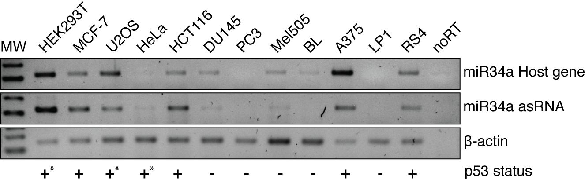

#Introduction
We wished to examine expression in different tissue types and, therefore, utilized a panel of common cell lines to detect miR34a asRNA expression, as well as, miR34a HG. We included both p53+/+ and p53-/- cell lines in the cell line panel due to the fact that miR34a is a known downstream target of p53. 

#Methods
Cells were cultured with the appropriate growth medium and seeded at a desity between 50-75% confluency. The following day, RNA was extracted using the RNeasy mini kit (Qiagen) and subsequently treated with DNase (Ambion Turbo DNA-free, Life Technologies). 500ng RNA was used for cDNA synthesis using MuMLV (Life Technologies) and a 1:1 mix of oligo(dT) and random nanomers. PCR was run for 35 or 38 or 16 cycles for miR34a asRNA, miR34a HG, and beta-actin, respectivley, with 58˚C annealing temperature. PCR products were analyzed on a 2% agarose gel.

##Primers

```{r}
library(printr)
primers <- data.frame(
    name=c(
        "miR34a asRNA F1",
        "miR34a asRNA R1",
        "miR34aHG_F",
        "miR34aHG_R",
        "B-actin_F",
        "B-actin_R"
    ),
    sequence=c(
        "AGC GGC ATC TCC TCC ACC TGA AA",
        "TTG CCT CGT GAG TCC AAG GAG AAT",
        "TCT GCT CCA GTG GCT GAT GAG AAA",
        "GTT CAC TGG CCT CAA AGT TGG CAT",
        "AGG TCA TCA CCA TTG GCA ATG AG",
        "CTT TGC GGA TGT CCA CGT CA"
    )
)
primers
```

#Results
<br></br>

##A)

<center></center>
<br></br>

##B)

<center></center>
<br></br>

Semi-quantitative PCR data from the screening of a panel of cell lines. 
* Indicates that, although the cell line is p53wt, other mechanisms are present which inhibit p53 function. 

#Conclusions
We were able to detect co-expression of both miR34a HG and miR34a AS in a variety of cell lines, including HCT116 human colon cancer cells and 293T human embryonic kidney cells. A correlation was observed between both miR34a HG and miR34a asRNA expression and p53 status, with p53+/+ cell lines tending to have higher expression of both transcripts.