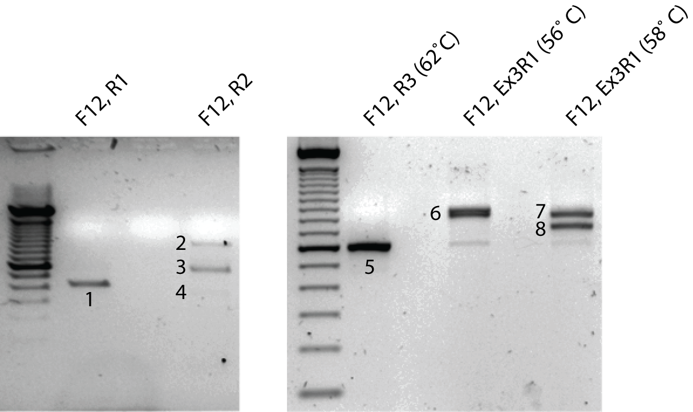
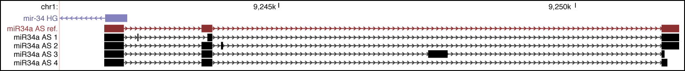

#Introduction
We investigated the propensity of miR34a asRNA to be alternatively spliced, using PCR cloning and sequencing.

#Methods
All cell lines were cultured at 5% CO2 and 37° C with U2OS cells cultured in McCoy’s 5a (Life Technologies), . All growth mediums were supplemented with 10% heat-inactivated FBS and 50 μg/ml of streptomycin and 50 μg/ml of penicillin. RNA was extracted using the RNeasy mini kit (Qiagen) and subsequently treated with DNase (Ambion Turbo DNA-free, Life Technologies). 500ng RNA was used for cDNA synthesis using MuMLV (Life Technologies) and a 1:1 mix of oligo(dT) and random nanomers. PCR was performed with the specified primer sets with annealing temperature 60˚C unless otherwise indicated. PCR was run for 35 cycles for those primer sets with annealing temperature 60˚C and 40 cycles in other cases. Resulting PCR products were run on a agarose gel, gel extracted with the QIAquick gel extraction kit (Qiagen), cloned using the Strata Cloning kit (Agilent), and sequenced.

<br></br>
<center></center>
<br></br>
Cloned isoforms of the miR34a asRNA gene.

##Primers
```{r}
library(printr)
primers <- data.frame(
    name=c(
        "F12",
        "R1",
        "R2",
        "R3",
        "Ex3R1"
    ),
    sequence=c(
        "AAACACAAGCGTTTACCTGGGTGC",
        "TTGCCTCGTGAGTCCAAGGAGAAT",
        "ATAGGTTCATTTGCCCGATGTGCC",
        "CCACAGCTGTTGCTTCTGAATGCT",
        "TCAGATAGGTACCAAAAATGATGGCCGCAACTAATGACGGAT"
    )
)
primers
```


#Results

Product 8 resulted in miR34a AS 1  
Product 6 resulted in miR34a AS 2  
Product 2 resulted in miR34a AS 3  
Product 5 resulted in miR34a AS 4  

<br></br>
<center></center>
<br></br>
Cloned isoforms of the miR34a asRNA gene.

#Conclusions
Results indicate that the miR34a asRNA transcript is post-transcriptionally spliced to form several different isoforms.