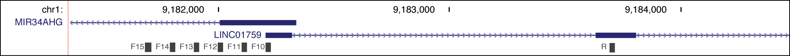
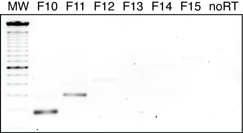

#Introduction
We desired to determine the 5'-start site for the miR34a asRNA.

#Methods
To accomplish this we performed the primer walk assay. All cell lines were cultured at 5% CO2 and 37° C with HEK293T cells cultured in DMEM high glucose (Hyclone). All growth mediums were supplemented with 10% heat-inactivated FBS and 50 μg/ml of streptomycin and 50 μg/ml of penicillin. RNA was extracted using the RNeasy mini kit (Qiagen) and subsequently treated with DNase (Ambion Turbo DNA-free, Life Technologies). 500ng RNA was used for cDNA synthesis using MuMLV (Life Technologies) and a 1:1 mix of oligo(dT) and random nanomers. PCR was performed for 35 cycles at 62°C annealing temperature and the resulting products were analyzed on a 2% agarose gel.


```{r}
primers <- data.frame(
    name=c(
        "miR34aAS_F10",
        "miR34aAS_F11",
        "miR34aAS_F12",
        "miR34aAS_F13",
        "miR34aAS_F14",
        "miR34aAS_F15",
        "miR34aAS_R1"
    ),
    sequence=c(
        "ACG CGT CTC TCC AGC CCG GGA T",
        "ATC TGC GTG GTC ACC GAG AAG CA",
        "CGC ACG GAC TGA GAA ACA CAA G",
        "ACG GAG GCT ACA CAA TTG AAC AGG",
        "AGG GAA GAA AGA ACT AGC CGA GCA",
        "CAT TTG CTG CAA TAT CAC CGT GGC",
        "TTG CCT CGT GAG TCC AAG GAG AAT"
    )
)
```

#Results

<br></br>
<center></center>
<br></br>
<center></center>
<br></br>
 A schematic picture of the miR34a asRNA locus including the location of the primers used in the primer walk assay and 
the semi-quantitative PCR results from the primer walk assay performed using HEK293T cells. 

#Conclusion
It appears as though the miR34a asRNA transcript start site is somewhat upstream of the annotated start site. Although there is some product present for the F12 primer, the majority of transcription seems to be origionating from the F11 primer. This indicates that the start site is between 71-224bp upstream of the annotated start site.